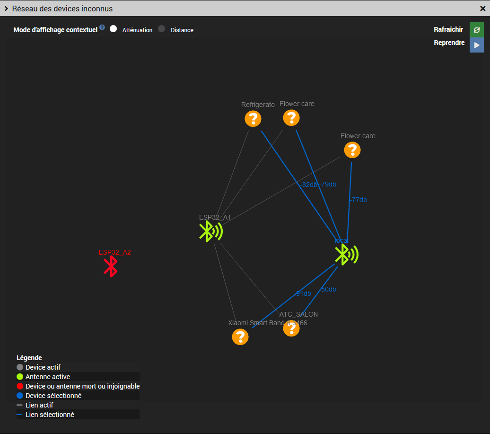

# Jeedom Plugin for Managing Bluetooth Devices and ESP32 BLE Antennas via MQTT


This plugin allows you to discover and manage Bluetooth devices and [OMG ESP32](https://docs.openmqttgateway.com) BLE antennas.  
<br>It is also compatible with [Theengs](https://gateway.theengs.io/) antennas.  
<br>It is compatible with the [#plugin-tgw](https://mips2648.github.io/jeedom-plugins-docs/tgw/en_US/)  
and can work with or without the [#plugin-mqtt2](https://doc.jeedom.com/en_US/plugins/programming/mqtt2)

## Documentation
- [Prerequisites](#prerequisites)
- [Configuration](#configuration)
- [Auto-Discovery](#auto-discovery)
- [Unknown Devices List](#unknown-devices-list)
- [Unknown Devices Network](#unknown-devices-network)
- [Known Devices List](#known-devices-list)
- [Known Devices Network](#known-devices-network)
- [Devices and Antennas](#devices-and-antennas)
- [Antennas Health](#antennas-health)
- [FAQ](#faq)
- [Bugs and Troubleshooting](#bugs-and-troubleshooting)

### Prerequisites

The plugin does not install antennas. Several options are available:

#### Antennas Managed by plugin-tgw

Simply check the corresponding box, see [Configuration](#configuration) below.

#### ESP32 and Manually Installed Antennas

Antennas must publish their information to one or more root topics, each grouping one or more antennas.  
<br>The auto-discovery topic is optional; if not provided, only presence will be available on the equipment. <br>
The structure must follow this schema:
```
/root_topic1/antenna1
/root_topic1/antenna2
/root_topic2/antenna3
...
/discovery_topic
```
Example: here a single root topic `theengs` with 2 antennas `tgw_local` and `tgw_remote`.
<br> Warning! `LWT` and `BTtoMQTT` must be directly under each antenna, otherwise check the `plugin-tgw` compatibility box.


### Broker Configuration

#### Local MQTT Broker (plugin-mqtt2)
By default in this mode, the plugin uses the `plugin-mqtt2` configuration (if installed).<br>
The `plugin-mqtt2` startup is automatic.


#### External MQTT Broker
In this mode, the MQTT broker startup is not managed by the plugin.
<br>It is necessary to provide the MQTT connection information.
- Broker address: default `mqtt://localhost:1883`
- Authentication: username and password


#### Common MQTT Parameters
- Discovery topic: Home Assistant compatible auto-discovery topic. Default: `homeassistant`
- Equipment root topics: `root_topics` monitored by the plugin (at least one). Sub-topics are not accepted.

#### Devices and Antennas
- TGW plugin compatibility: enable this if your antennas are managed by the `plugin-tgw`. In this case, the root topic is automatically filled in.
- Automatic creation: automatically create BLE devices (disabled by default)
- Auto-discovery duration: detection duration for antennas and devices (in minutes)
- Missing timeout: delay after which inactive devices will be removed (in minutes, 0 to keep them indefinitely)

#### System

- Daemon port: default `55036`, do not change unless there is a conflict

### Auto-Discovery

Auto-discovery is active on startup, and detected antennas are automatically added. You can also stop or restart it using the `Auto-discovery` button.
<br>If automatic creation has been checked on the configuration page, devices will be automatically added at the end of synchronization.


### Unknown Devices List

Displays all unmanaged devices. The `Discoverable` column indicates whether devices support auto-discovery or not. The `display absent devices` option allows you to see auto-discovered devices that are not reachable. It is possible to filter table rows by clicking on column headers.

<br>The `Add` button allows you to add discovered devices one by one. If the device is auto-discoverable, its commands will be automatically created; otherwise, only presence and RSSI will be available.


### Unknown Devices Network

The contextual display can be shown by attenuation or by distance (if supported by the antenna).
<br>It is activated by selecting a node. The animation can be paused and the graph is zoomable.


### Known Devices List

Displays already added devices. It is possible to display absent devices and filter table rows by clicking on column headers.


### Known Devices Network

The contextual display can be shown by attenuation or by distance (if supported by the antenna).
It is activated by selecting a node.
<br>The animation can be paused. It is also possible to filter absent devices.


### Devices and Antennas
Available commands depend on the type of device or antenna.
<br> A custom image can be added by equipment category.

Theengs antennas have no commands except presence.
<br>ESP32 antennas have several additional commands, see the `Bluetooth` and `System` tabs.
<br>The `Web Console` button provides access to the ESP32 administration interface.
<br>For more information, see the [ESP32 Theengs commands documentation](https://docs.openmqttgateway.com/use/gateway.html#system-commands-esp-only).


#### Custom Commands
The `Custom` tab allows you to add custom commands that may be present in advertising data but not in auto-discovery (depending on the device). For example, here the temperature in Fahrenheit (`tempf`) for a reprogrammed Xiaomi `lywsd03mmc`:


Similarly for missing `ESP32` commands such as enabling/disabling external decoding or the number of messages received:

 

For actions, the `payload` field must be in the format `"key1":value1 , "key2":value2...`
<br>Advertising data and auto-discovered data are available in the `Other Data` column of the [Unknown Devices List](#unknown-devices-list) page

### Antennas Health


### FAQ

- Antennas are not detected or some devices do not appear as discoverable:
<br>Check your root topics
<br>Restart auto-discovery on your antennas (`BT: Force scan` or reboot the ESP32 or Theengs antenna)
- ESP32 commands are not created
<br>Enable the `SYS: Auto discovery` parameter
- Advertising data is not displayed (ESP32)
<br> Enable the `BT: Publish Advertisement data` parameter
- Distances are not displayed
<br>Only ESP32s report this information starting from firmware v1.8 (experimental feature). To enable this, activate the `BT: Publish HASS presence` parameter

### Bugs and Troubleshooting
See the [Jeedom community](https://community.jeedom.com/tag/plugin-blescanner) forum
