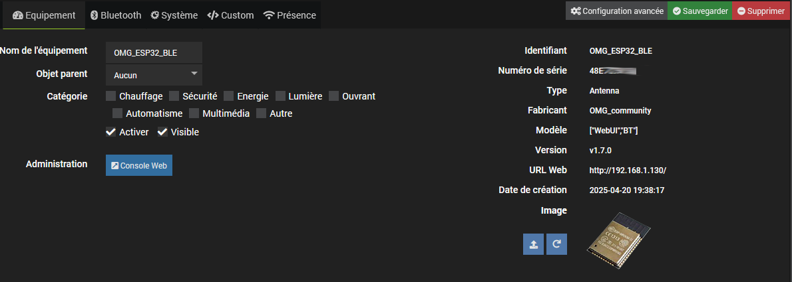

# Plugin Jeedom pour gérer les devices Bluetooth et les antennes BLE ESP32 par MQTT

Ce plugin permet de découvrir/gérer les devices bluetooth et les antennes BLE [OMG ESP32](https://docs.openmqttgateway.com). Les antennes [Theengs](https://gateway.theengs.io) sont aussi reconnues mais pas leurs paramètres car elles ne supportent pas (encore?) l'auto-découverte Home Assistant. Il ne remplace pas le [#plugin-theengs](https://mips2648.github.io/jeedom-plugins-docs/tgw/fr_FR/) pour déployer et gérer les antennes Theengs.

## Documentation
- [Configuration](#configuration)
- [Auto-découverte](#auto-découverte)
- [Liste des devices inconnus](#liste-des-devices-inconnus)
- [Réseau des devices inconnus](#réseau-des-devices-inconnus)
- [Liste des devices connus](#liste-des-devices-connus)
- [Réseau des devices connus](#réseau-des-devices-connus)
- [Devices et Antennes](#devices-et-antennes)
- [Santé Antennes](#santé-antennes)
- [FAQ](#faq)
- [Bugs et dépannage](#bugs-et-dépannage)

### Configuration

Le plugin requiert le [#plugin-mqtt2](https://doc.jeedom.com/fr_FR/plugins/programming/mqtt2).

#### Broker MQTT
- Adresse du broker: défaut `mqtt://localhost:1883`
- Authentification: utilisateur et mot de passe
- Topic de découverte: topic Home Assistant. défaut: `homeassistant`
- Topics racines des équipements: topics surveillés par le plugin (au moins un). 

#### Devices et Antennes
- Création automatique: création automatique des devices BLE (désactivé par défaut)
- Durée d'auto-découverte: délai de détection des antennes et des devices (en minutes)
- Délai d'absence: délai après lequel les devices inactifs seront supprimés (en minutes, 0 pour les garder indéfiniment)

#### Système

- Port du deamon: défault `55036`, ne pas changer sauf conflit

### Auto-découverte

L'auto-découverte est active au démarrage, les antennes détectées sont ajoutées automatiquement. Vous pouvez également l'interrompre ou la relancer avec le bouton `Auto-découverte`. 
 Si la création automatique a été cochée sur la page configuration les devices seront automatiquement ajoutés en fin de synchroniation.

### Liste des devices inconnus

Affiche tous les devices non gérés. La colonne `Découvrable` permet de déterminer si les devices supportent l'auto-découverte ou pas. L'option `afficher les devices absents` permet de voir les devices auto-découverts qui ne sont pas joignables. Il est possible de filtrer les lignes du tableau par clic sur les entêtes de colonnes.

 Le bouton `Ajouter` permet d'ajouter les devices découverts un par un. Si le device est auto-découvrable ses commandes seront automatiquement créées, sinon seuls la présence et le RSSI seront disponibles.

### Réseau des devices inconnus

L'affichage contextuel peut se faire par atténuation ou par distance (si supporté par l'antenne). 
 Il s'active en sélectionnant un noeud. L'animation peut être mise en pause et le graphe est zoomable.

### Liste des devices connus

Sont affichés les devices déjà ajoutés. Il est possible d'afficher les devices absents et de filtrer les lignes du tableau par clic sur les entêtes de colonnes.

### Réseau des devices connus

L'affichage contextuel peut se faire par atténuation ou par distance (si supporté par l'antenne). 
Il s'active en sélectionnant un noeud. 
 L'animation peut être mise en pause.  Il est également possible de filter les devices absents.

### Devices et Antennes
Les commandes disponibles dépendent du type de device ou d'antenne.
  Une image personnalisée peut être ajoutée par catégorie d'équipement.

Les antennes Theengs n'ont aucune commande sauf la présence. Les antennes ESP32 possèdent plusieurs commandes supplémentaires, cf les onglets `Bluetooth` et `Système`.
 Le bouton `Console web` permet d'accéder à l'interface d'administration des ESP32. 
 Pour plus d'informations voir la doc des [commandes ESP32](https://docs.openmqttgateway.com/use/gateway.html#system-commands-esp-only)

#### Commandes personnalisées
L'onglet `Custom` permet d'ajouter des commandes personnalisées qui seraient présentes dans l'advertising mais pas dans l'auto-découverte (selon les devices), par ex ici la température en Farenheit (`tempf`) pour un Xiaomi `lywsd03mmc` reprogrammé:

Idem pour les commandes manquantes d'un `ESP32` comme l'activation/désactivation du décodage externe ou le nombre de messages recus:

 

Pour les actions le champ `payload` doit être de la forme `"clé1":valeur1 , "clé2":valeur2...`
 Les données d'advertising et les données auto-découvertes sont disponibles dans la colonne `Autres données` de la page [Liste des devices inconnus](#liste-des-devices-inconnus)

### Santé Antennes

### FAQ

- Les antennes ne sont pas détectées ou certains devices ne s'affichent pas comme découvrables:
 Relancez l'auto-découverte sur vos antennes (`BT: Force scan` ou reboot de l'ESP32 ou de l'antenne Theengs)
- Les commandes ESP32 ne sont pas créées
 Activez le paramètre `SYS: Auto discovery`
- Les données d'advertising ne s'affichent pas (ESP32)
  Activez le paramètre `BT: Publish Advertisement data` 
- Les distances ne s'affichent pas
 Seuls les ESP32 remontent cette information à partir du fw v1.8 (feature expérimentale). Pour cela activez le paramètre `BT: Publish HASS presence`

### Bugs et dépannage
Voir le forum [Jeedom community](https://community.jeedom.com)
